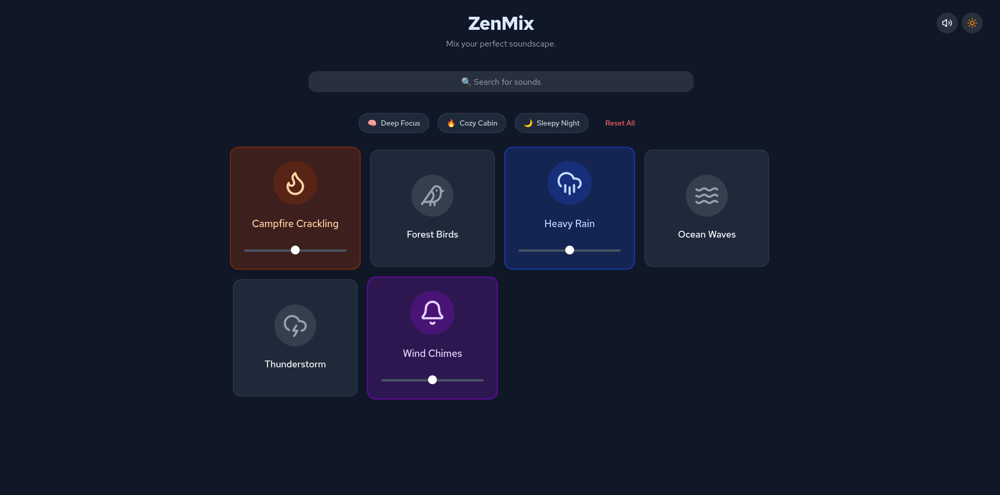

# ZenMix

**Focus better. Relax deeper. Build your perfect soundscape.**



<!-- _(Live demo: https://zenmix.live)_ -->

## About

ZenMix is a free, open-source, browser-based ambient sound mixer that finally gives you **individual volume control** for every sound.

Layer rain, thunder, fireplace, coffee shop, forest, waves, white noise — whatever helps you focus or relax — and tweak each one exactly how you like it.

No accounts. No ads. No bloat. Works offline once loaded.

## Features

- Individual volume sliders for every sound
- Beautiful minimalist UI
- Works on desktop + mobile
- Zero dependencies beyond React
- Super easy to add new sounds (see below)

## Tech Stack

- React 18 + Vite
- Tailwind CSS v4
- Lucide React icons
- No state management libraries

## Quick Start

```bash
git clone https://github.com/YOUR_USERNAME/zenmix.git
cd zenmix
npm install
npm run dev
```

Open http://localhost:5173 and start mixing.

## How to Contribute (Easiest First Contribution Ever)

### Add a new sound in literally 3 steps

1. Drop a royalty-free MP3 into `public/sounds/your-sound.mp3`
   (Try [Pixabay](https://pixabay.com/sound-effects/) or [Freesound](https://freesound.org/))

2. Add it to `src/data/sounds.json`:

```json
{
  "id": "coffee-shop",
  "label": "Coffee Shop",
  "icon": "Coffee",
  "src": "/sounds/coffee-shop.mp3",
  "color": "bg-amber-600"
}
```

3. Open a Pull Request — that’s it!

### Other beginner-friendly ideas

- "Mute All" button
- Pomodoro timer overlay
- Save/load mixes (localStorage)
- Dark/light mode toggle
- Preset mixes (Rainy Day, Cozy Night, etc.)

## Project Structure

```
public/sounds/           ← Put MP3 files here
src/components/          ← UI components
src/data/sounds.json     ← All sounds are defined here
src/hooks/               ← Custom hooks
```

## License

MIT License — fork it, ship it, whatever.

Made with love (and a lot of coffee) — happy focusing!
